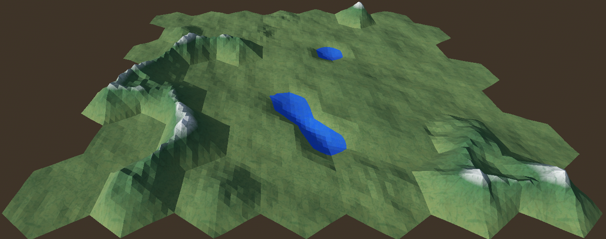

# Sota

Editable hexagonal terrain generator for Godot 4

## Features
1. Different types of tiles: plain, hill, water, moutain. Easy to add new type.
2. Adjustable number of rows/columns of terrain.
3. Adjustable boundaries: top of moutains, bottom of water, hill level.
4. Adjustable curvature of moutains.
5. Adjustable tesselation level of hexagons.
6. Smooth shading ON/OFF.
7. Separate noises to make:
    - Different configuration of terrain types.
    - Shapes of mountain/water tiles
    - Shapes of hill/plain tiles
   

## Getting started
- Use standard library asset from godot
- Build from sources, see "System setup" at [CONTRIBUTING.md](CONTRIBUTING.md)

## Contibuting
Please, see [CONTRIBUTING.md](CONTRIBUTING.md) if you want to make pull request.

Apart from making PR I will also highly appreciate if you:
1. Raise an issue about bug or suggest new feature.
2. Star repo if you like it.
3. Use discord [link](https://discord.gg/6ZKQ8BfM) or ardazishvili.roma@gmail.com for your positive/negative feedback.
4. Make a donation: [boosty](https://boosty.to/ardazishvili/donate), [patreon](https://patreon.com/RomanArdazishvili?utm_medium=unknown&utm_source=join_link&utm_campaign=creatorshare_creator&utm_content=copyLink).

## Roadmap
There are features I want to implement already, but I want a roadmap based on user's needs. So, your opinion is most valuable thing.

## IDE support
Author didn't use any IDE but nothing stops us to add project files of IDE you use, if it's popular enough. Please, make a PR then.

## Licence
Addon has been released under the [MIT License](https://github.com/ardazishvili/Sota/blob/main/LICENSE).

## Acknowledgements
1. [Hexagonal grids](https://www.redblobgames.com/grids/hexagons/) by Red Blob Games
