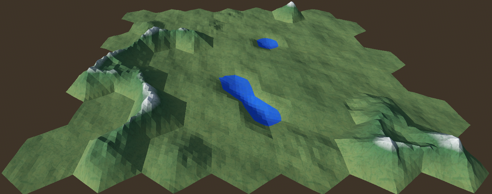

# Sota

Editable generator of discrete structures for Godot 4

## Getting started
- Use standard library asset from godot
- Build from sources, see "System setup" at [CONTRIBUTING.md](CONTRIBUTING.md)

## Documentation
See [read the docs](https://sota.readthedocs.io/en/latest/) for online documentation.

## Contibuting
Please, see [CONTRIBUTING.md](CONTRIBUTING.md) if you want to make pull request.

Apart from making PR I will also highly appreciate if you:
1. Raise an issue about bug or suggest new feature.
2. Star repo if you like it.
3. Use discord [link](https://discord.gg/rAxTbS9Tfn) or ardazishvili.roma@gmail.com for your positive/negative feedback.
4. Make a donation: [boosty](https://boosty.to/ardazishvili/donate), [patreon](https://patreon.com/RomanArdazishvili?utm_medium=unknown&utm_source=join_link&utm_campaign=creatorshare_creator&utm_content=copyLink).

## Licence
Addon has been released under the [MIT License](https://github.com/ardazishvili/Sota/blob/main/LICENSE).

## Acknowledgements
1. [Hexagonal grids](https://www.redblobgames.com/grids/hexagons/) by Red Blob Games
